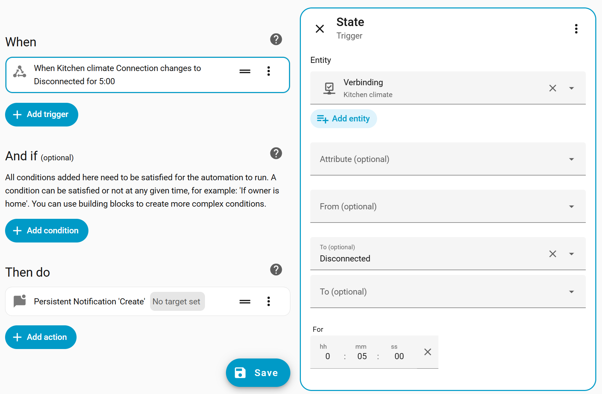

# 🔌 MQTT Connection State

This custom integration creates a diagnostic sensor for MQTT devices that shows the **MQTT connection state** of a device based on its MQTT *availability* or *state* topic.

> [!CAUTION]
> 🚧 This integration is still in **beta**.

## What it can do ✅

It can:

* 🔍 **Discover** MQTT devices with connection topics
* 🔄 **Auto-update** when device information or topics change
* 🚨 Raise **Repair issues** when a device becomes orphaned
* ⚡ Use **actions** for bulk setup in new installs
* 🔔 Easily trigger **notification automations** using events

## 🔗 Quick Go To

* [Installation](#-installation)
* [Features](#-features)
* [Actions](#%EF%B8%8F-actions)
* [Automation ideas](#-automation-ideas)

## 📦 Installation

### 🧩 HACS

* Go to the HACS dashboard (`/hacs/dashboard`)
* Select the three dots in the top-right corner → **Custom repositories**
* Fill in the repository:

```
https://github.com/studioIngrid/mqtt_connection_state
```

Type: `integration`

* Click *Add*, then close the popup
* Search for:

```
MQTT connection state
```

* Click *Download* (bottom right)
* Restart Home Assistant
* Go to *Settings* → *Devices & Services* → *Integrations*
* Manually add the first device:
   *Add integration* → search for *MQTT connection state → *Select a device*
* Within the first 10 minutes, discovered devices should appear for easy configuration
* For configuring multiple devices, see [Actions](#%EF%B8%8F-actions)

### 🛠️ Manual

The prefered method is using HACS, their you can be informed about new releases.

* Download the contents of this repository
* Add the folder to your config at:
   `config/custom_components/mqtt_connection_state`
* Restart Home Assistant
* Manually add the first device:
    *Add integration* → search for *MQTT connection state → *Select a device*
* Within the first 10 minutes, discovered devices should appear for easy configuration
* For configuring multiple devices, see [Actions](#%EF%B8%8F-actions)

### 🐝 Zigbee2MQTT

Availability is **disabled by default** in Zigbee2MQTT. If no availability topic is found, the device will **not** be discovered. To enable availability in `configuration.yaml`, see the official documentation: [Zigbee2MQTT Device Availability](https://www.zigbee2mqtt.io/guide/configuration/device-availability.html)

#### Short version

Use a file editor such as the **File Editor** add-on or **Studio Code Server** to open the Zigbee2MQTT `configuration.yaml` file.

**Z2M Docker users**: you are likely already familiar with this file.
**Z2M add-on users**: availability cannot be enabled via the add-on configuration UI. In the add-on configuration page, note the value of "data_path" (the first field). Navigate to the folder specified in `data_path` and open `z2m/configuration.yaml`.

Add or update the following settings:

```yaml
device_options:
  homeassistant:
    last_seen:
      enabled_by_default: true
      availability: []
availability:
  enabled: true
```

After this, Zigbee2MQTT will publish availability topics, allowing devices to be discovered correctly.

## ✨ Features

### 🔍 Automatic Discovery

* Periodically scans the device registry for MQTT devices with an availability or status topic
* If multiple topics are found, the last found topic is used

### 🚨 Orphan Detection & Repairs

* If the connection sensor loses its parent (e.g. device drops off), a **Home Assistant Repair issue** is raised
* When the parent is rediscovered, the issue is automatically closed
* Alternatively, you can delete the connection sensor directly from the issue

### 🧩 Entity Behavior

The device gets one entity: `binary_sensor.<device_name>_connection_state`

* Displayed names can be translated
* Currently supported languages: **EN** and **NL**

### ⚡ Bulk setup

The integration can automatically complete configuration for discovered devices.
This avoids having to click *Add* a hundred (or more 😉) times.
There are two actions you can use to list devices available for setup, and bulk confirm configuration. See [Actions](#%EF%B8%8F-actions) for details.

### 🔔 Events

This integration fires an event on **every connection state change**, which makes event-based automations the most flexible and scalable approach.

Example of event format:

```
event_type: mqtt_connection_state_changed
data:
  state: offline
  device_id: c940be963f2b3080a1d48fc5f9973298
  device_name: Livingroom motion
  entity_id: binary_sensor.livingroom_motion_connection_state
```

## ⚙️ Actions

### 📋 List New Devices

When you first install the integration, you may have **many devices** to add.
This action returns a list of newly discovered devices, which you can then use for bulk setup with *Add new devices*.

Example response:

```
new_devices: |-
  [
    {
      "id": "c940be963f2b3080a1d48fc5f9973298",
      "name": "Livingroom motion"
    },
    {
      "id": "bf3414747ac5107f90f389a78420ece3",
      "name": "Livingroom climate"
    },
  ]
```

To prepare this list as input for *Add new devices*.

### ➕ Add New Devices

This action can only be performed by **admins**. And only **previously discovered devices** can be bulk added.

The required input is a JSON string (format shown below).
Only the `"id"` field is used; all other attributes are ignored.

```
  [
    {
      "id": "c940be963f2b3080a1d48fc5f9973298",
    },
    {
      "id": "bf3414747ac5107f90f389a78420ece3",
      "name": "Livingroom climate" <------ # optional, will be ignored
    },
  ]
```

#### 🧪 Prepare Output from *List new devices*

Notes on JSON formatting:

* In JSON indentation is not important
* Brackets and commas are important
* Remove the first line: `new_devices: |-`
* Remove unwanted devices from `{` to `},`
* JSON does not allow trailing commas
* You can validate your JSON using a tool like [curious concept JSON formatter](https://jsonformatter.curiousconcept.com/)
  (enable **fix JSON** to remove trailing commas)
* If using an LLM, note that the string will be evaluated using Python’s `json.loads()`

## 🔔 Automation ideas

To get notified when devices go offline or come back online, you can create automations based on **events**.
This integration fires an event on **every connection state change**, which makes event-based automations the most flexible and scalable approach.

You can use these fields directly in triggers for automations.

### 📩 Basic notifications for offline devices

Create an automation triggered by the `mqtt_connection_state_changed` event.

> **Recommended:** Add a condition that checks whether your bridge (for example Zigbee2MQTT) is online. This helps prevent a burst of notifications during Home Assistant startup.

Event type:

```
mqtt_connection_state_changed
```

Event data:

```
state: offline
```


Example automation:

```
alias: "Notify conecction state offline"
description: "Using the mqtt_conecction_state events for monitoring"
mode: parallel
max: 50
trace:
  stored_traces: 50
triggers:
  - trigger: event
    event_type: mqtt_connection_state_changed
    event_data:
      state: offline
conditions:
  - condition: state
    entity_id: binary_sensor.zigbee2mqtt_bridge_connection_state
    state: "on"
    for:
      minutes: 1
actions:
  - alias: Report offline devices in HA notifications
    action: persistent_notification.create
    data:
      title: Device offline
      message: >-
        {{ trigger.event.data.device_name }} went offline</br></br>
        <small><a href="/config/devices/device/{{ trigger.event.data.device_id }}">Device</a></small></br>
        <small>{{ now()  | as_timestamp | timestamp_custom('%H:%M') }}</small>
  - alias: If important device send notification to phone
    if:
      - condition: template
        value_template: >-
          
          {{ trigger.event.data.entity_id in important_devices }}
    then:
      - action: notify.mobile_app_iphone
        data:
          title: Device offline
          message: "{{ trigger.event.data.device_name }} went offline"
```

### 🎯 Automations for a specific device

If you only want to monitor a specific device, you can choose from multiple trigger types depending on your preference and use case.

#### Device trigger

Use the device trigger when you prefer selecting the device through the UI and keeping the automation device-centered.


#### Entity trigger

Use the entity trigger if you want easy to read YAML.



#### Event trigger

Use an event trigger and include a unique identifier such as `device_id` or `entity_id` in the event data as a filter.

Example event data:

```
state: offline
device_id: c940be963f2b3080a1d48fc5f9973298
```


